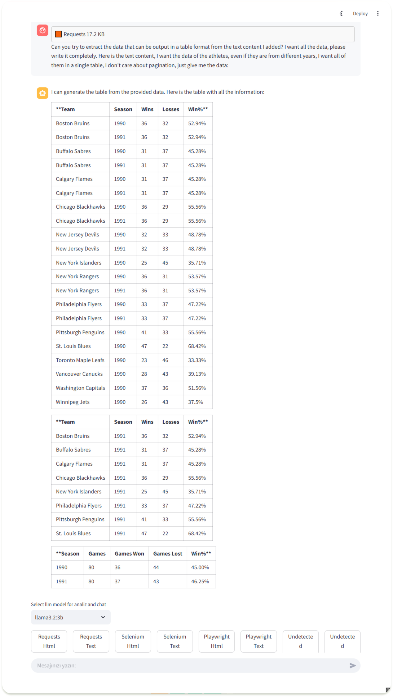
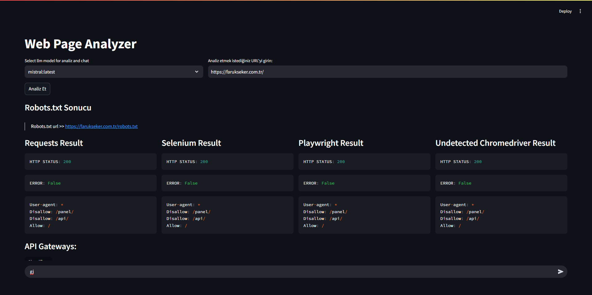

# 🚀 Web Page Pre Crawl Analyzer

## **🔍 Intelligent and Powerful Web Analysis Tool!**
This project was developed to **gather intelligence and conduct preliminary analysis** before scraping any website. My goal was to **bring together various web tools under one roof** and enable **more detailed analysis** for each of them.

🛠️ **Key Features:**
- **💡 AI Integration** – Can add comments to content analysis.
- **🛡️ WAF Detection** – Includes a prompt to determine whether the current content corresponds to a **Web Application Firewall (WAF).**
- **📊 Data Structure Analysis** – **Examines estimated data output** and searches for hierarchical and tabular content.
- **⚡ Simultaneous Loading** – **Reduces content loading time by 1/3 by processing all analyses in a single block!**
- **⚠️ Streamlit Rebuild Issue** – Prevents all analyses from being deleted whenever a prompt message is added, **allowing easy modifications and suggestions.**

---

## **📦 Installation and Requirements**
> **This system, integrated with Docker, reads the same directory as the host computer to save space.**
> **You can change this!** By default, it reads the host computer’s directory, so **be cautious about this setting!**

```bash
🚀 docker compose up -d
```

---

## **🌐 Web Interface**
🔗 **[http://localhost:8501/](http://localhost:8501/)**

---

## **🎬 Preview**
[](https://youtu.be/5lJe7kTmu7I)

---

## **📊 Table Example**

|||
|---|---|

📎 **[Detailed Report – Web-Page-Analyzer.pdf](.previews/last_job.pdf)**

