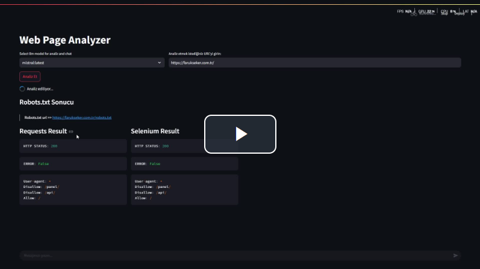

# Web Page Pre Crawl Analyzer

This project was created to gather intelligence and do preliminary analysis before scraping any website. My first goal was to bring together various web tools under one roof and to be able to do more detailed analysis for each of them. I wanted to add an AI tool so that it could add a comment to the analysis of the content. I added promt to decide whether the current content corresponds to a waf or not. The last stage is to analyze the estimated data output and search for its hierarchical and tabular content. I want to write these in a single block so that I can reduce the time it takes to load the content to 3/1 by waiting for all of them at the same time and the last problem is that whenever the user adds a promt message, all the analyses are deleted because streamlit rebulds, you can easily add and make suggestions.

### requirements and installation
> In this system integrated with docker, it reads the same directory as the host computer for space saving. You can change this. By default, it reads the same directory as the host computer, be careful about this.

```bash
docker compose up -d
``` 
### web address [http://localhost:8501/](http://localhost:8501/)

[](https://youtu.be/m7AliZLFArU)

> + [Web-Page-Analyzer.pdf](.previews/Web-Page-Analyzer.pdf)